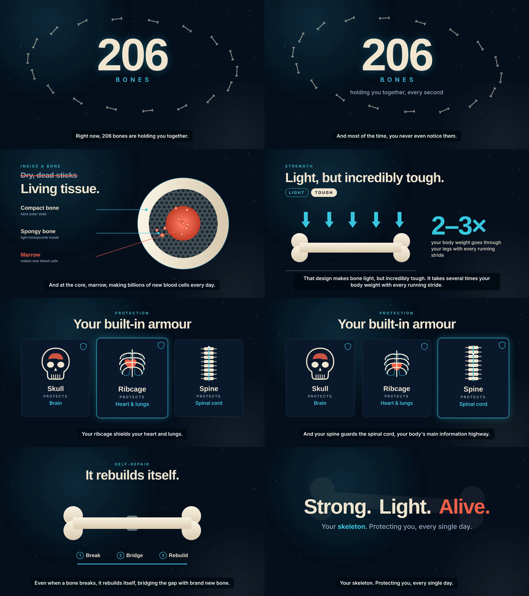

# How Bones Protect You — 59 s explainer

Final video: [`renders/bones-explainer-final.mp4`](renders/bones-explainer-final.mp4)
(1920×1080, 30 fps, H.264 + AAC, −14 LUFS).



## Structure
| Scene | Time | Beat |
| --- | --- | --- |
| 1 Hook | 0.0–8.0 | "206" counter + orbit of bones |
| 2 Living tissue | 8.0–22.7 | Cross-section: compact shell → spongy honeycomb → marrow + blood cells |
| 3 Strength | 22.7–30.7 | "Light / Tough", force arrows, 2–3× body weight per running stride |
| 4 Armour | 30.7–44.9 | Skull → brain, ribcage → heart & lungs, spine → spinal cord |
| 5 Self-repair | 44.9–50.8 | Fracture → bridge (callus) → rebuild |
| 6 Outro | 50.8–58.9 | "Strong. Light. Alive." |

Transitions: zoom-through, push, circular reveal, blur crossfade, cyan wipe.
Voiceover: Kokoro-82M `bm_george` @ 1.07× (local, free). Music pad and SFX are
synthesised with FFmpeg. Captions are burned in.

## Rebuild / edit
Run from inside `hyperframes-student-kit/video-projects/<slug>/` (copy this
folder there) with Node 22+, FFmpeg and Python `kokoro-onnx` + `soundfile`
(`HYPERFRAMES_PYTHON` → that venv's python):

```sh
# 1. change narration lines in script.tsv (scene<TAB>line<TAB>text), then:
rm assets/vo/*.wav
while IFS=$'\t' read -r s n t; do npx hyperframes tts "$t" --voice bm_george --speed 1.07 --output assets/vo/l$n.wav </dev/null; done < script.tsv
node build-audio.mjs     # → timeline.json + assets/narration.wav
node build-sfx.mjs       # → assets/music.wav + assets/sfx.wav (gitignored, regenerate)
# 2. if line times changed, update the times in index.html (captions + tweens)
npx hyperframes lint && npx hyperframes check
npx hyperframes render --quality standard --output renders/bones-explainer.mp4
ffmpeg -i renders/bones-explainer.mp4 -c:v copy -af loudnorm=I=-14:TP=-1.5:LRA=11 -c:a aac -b:a 192k renders/bones-explainer-final.mp4
```

## Verification (2026-09-26)
- `hyperframes lint`: 0 errors (2 file-size warnings, accepted).
- `hyperframes check`: passed; 25/25 text elements pass WCAG AA contrast.
- Hero frames and all 5 transition boundaries inspected: no black flashes,
  overflow or clipped labels. Outro background bone toned down after review.
- Loudness normalised −18.4 → −14.0 LUFS integrated.
